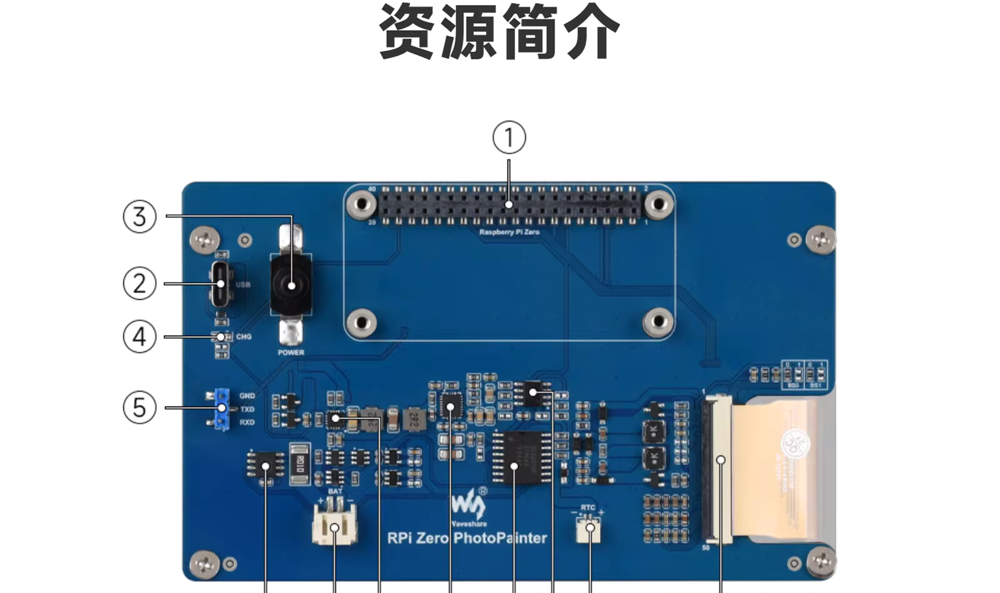
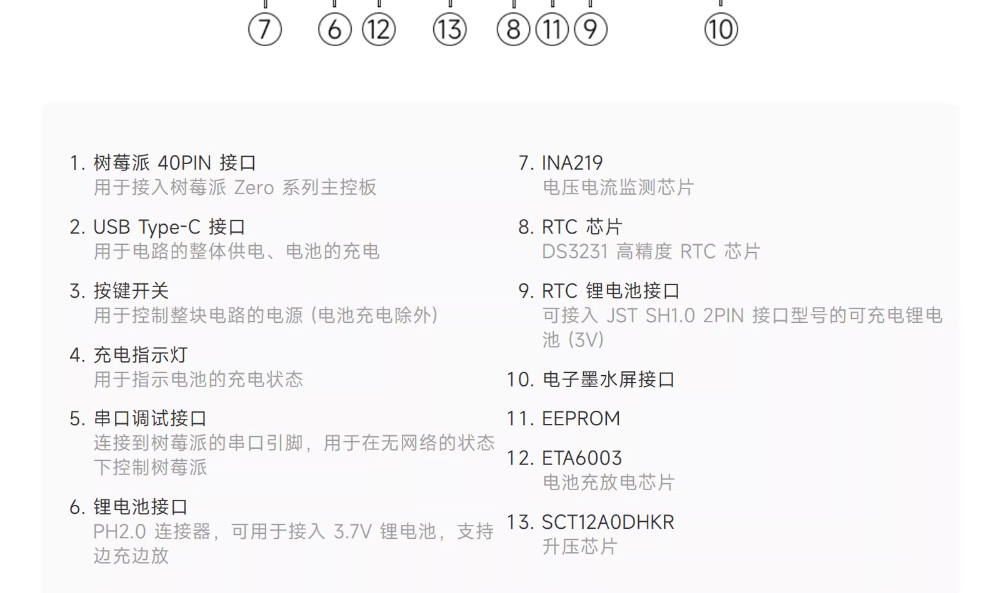

# 团子相册

<p align="center">
  
</p>

<p align="center">
  运行在树莓派 Zero 2W 上的 6 色墨水屏电子相册
</p>

`团子相册` 是一个面向真实硬件部署的电子相册项目：前端提供照片管理和定时刷新界面，后端负责编排 OSS、SQLite、墨水屏驱动、UPS 电量读取和定时任务，最终把照片推送到微雪 6 色电子纸上显示。

这个仓库当前采用 `pnpm` monorepo，前后端分离，并通过共享 TypeScript 类型包协作。

## 项目特性

- 面向树莓派 Zero 2W 的低内存部署方案
- 桌面端与移动端双布局照片管理界面
- 照片上传到阿里云 OSS，前端可按标签筛选
- 一键推送指定照片到墨水屏
- 支持“每天定时”或“固定间隔”两种刷新模式
- 支持“按上传时间”或“随机”两种选图策略
- 支持按标签范围参与定时刷新
- 渲染历史持久化，定时刷新会优先照顾较少被展示的照片
- 电池状态轮询展示，适配 UPS 供电场景
- 基于缓存的 BMP 复用，避免重复图片处理

## 技术栈

- 前端：Vue 3、Vite 7、Pinia、Vue Router、`@nuxt/ui` v4
- 后端：Fastify v5、better-sqlite3、sharp
- 共享类型：TypeScript workspace package
- 驱动集成：Node.js + Python
- 运行环境：Raspberry Pi Zero 2W、微雪电子纸、微雪 UPS

## 硬件与系统

- 主控：Raspberry Pi Zero 2W
- 系统：Raspberry Pi OS Lite 64-bit
- 套件参考：Waveshare `RPi Zero PhotoPainter`
- 官方 Wiki：<https://www.waveshare.net/wiki/RPi_Zero_PhotoPainter>

### 套件硬件参考图

<p align="center">
  
</p>
<p align="center">
  
</p>

## 仓库结构

```text
apps/frontend          Vue 3 + Vite 前端应用
apps/backend           Fastify 后端应用
packages/shared-types  前后端共享 TypeScript 类型
scripts/               构建、部署和 systemd 相关脚本
release/frontend/      前端发布产物（由开发机构建并提交）
release/backend/       后端发布产物（由树莓派本地构建生成，不提交）
release/VERSION        当前前端发布版本号
data/                  运行时数据目录
```

## 系统架构

### 前端

- 运行在 `127.0.0.1:4011`
- 通过 Vite 代理把 `/api/*` 转发到后端 `127.0.0.1:4010`
- 使用 Pinia 管理照片、定时配置和电池状态
- 首页按断点切换桌面布局和移动布局

### 后端

- 运行在 `0.0.0.0:4010`
- 提供照片、标签、定时刷新、电池状态等 REST API
- 使用 SQLite 保存元数据与渲染历史
- 使用阿里云 OSS 存储原始照片
- 通过 `child_process.spawn()` 调用 Python 驱动完成墨水屏刷新与电池读取
- 生产环境会托管 `release/frontend/` 中的前端静态文件

### 硬件驱动

- `apps/backend/driver/waveshare`：微雪电子纸驱动及渲染脚本
- `apps/backend/driver/ups`：微雪 UPS 电量读取脚本
- 两者都通过 Node 侧 `spawn()` 发起调用，而不是直接嵌入业务逻辑

## 当前能力

### UI 能力

- 照片网格浏览
- 标签筛选
- 照片详情浮层
- 上传、删除、手动推送
- 定时刷新配置面板
- 电池状态展示

### API 概览

- `GET /health`
- `GET /api/v1/photos`
- `POST /api/v1/photos/upload`
- `DELETE /api/v1/photos/:id`
- `POST /api/v1/photos/:id/push`
- `GET /api/v1/tags`
- `GET /api/v1/schedule`
- `PUT /api/v1/schedule`
- `POST /api/v1/schedule/trigger`
- `GET /api/v1/battery`

## 运行时数据

项目运行时数据默认写在仓库根目录的 `data/` 下：

- `data/main/main.db`：SQLite 主数据库
- `data/main/render_history.json`：渲染历史快照
- `data/cache/`：BMP 渲染缓存
- `data/logs/`：运行日志目录预留

## 环境要求

### 开发机

- Node.js `>= 18.12`
- `pnpm` `10.x`

### 树莓派

- Raspberry Pi Zero 2W
- Node.js `>= 18.12`
- `pnpm`
- Python 3
- `pip3`
- systemd
- 微雪电子纸和 UPS 相关硬件依赖

## 快速开始

### 1. 安装依赖

```bash
pnpm install
```

### 2. 配置后端环境变量

```bash
cp apps/backend/.env.example apps/backend/.env
```

默认开发配置如下：

```dotenv
NODE_ENV=development
HOST=0.0.0.0
PORT=4010
EPD_PYTHON_BIN=python3
EPD_RENDER_TIMEOUT_MS=180000
OSS_REGION=""
OSS_ENDPOINT=""
OSS_BUCKET=""
OSS_ACCESS_KEY_ID=""
OSS_ACCESS_KEY_SECRET=""
```

其中 OSS 相关字段是照片上传和图片处理链路所必需的。

### 3. 启动本地开发

后端：

```bash
cd apps/backend
pnpm dev
```

前端：

```bash
cd apps/frontend
pnpm dev
```

开发环境地址：

- 前端：`http://127.0.0.1:4011`
- 后端：`http://127.0.0.1:4010`

## 常用命令

### 仓库根目录

```bash
pnpm install
pnpm format
pnpm build:frontend
pnpm build:backend
pnpm run:pi
```

### 前端

```bash
cd apps/frontend
pnpm dev
pnpm build
pnpm build:pi
pnpm preview
pnpm typecheck
```

### 后端

```bash
cd apps/backend
pnpm dev
pnpm build
pnpm build:pi
pnpm typecheck
```

## 部署流程

当前仓库的部署方式是：

- 前端在开发机构建后，把 `release/frontend/` 和 `release/VERSION` 提交到 Git
- 树莓派本地构建后端，并生成 `release/backend/`
- 生产环境由 systemd 启动 `release/backend/app.js`

### 第一步：开发机构建前端

```bash
pnpm build:frontend
```

这个脚本会：

1. 执行前端构建
2. 刷新 `release/frontend/`
3. 将根 `package.json` 里的版本号写入 `release/VERSION`

构建完成后，提交前端发布产物：

```bash
git add release/frontend release/VERSION
git commit -m "chore: release frontend artifacts"
git push
```

### 第二步：树莓派部署后端并安装服务

首次部署或后端更新后，在树莓派执行：

```bash
git pull
pnpm run:pi
```

这个流程会：

1. 停掉旧服务释放内存
2. 确保 `apps/backend/.env` 存在并设置 `NODE_ENV=production`
3. 准备 `data/main`、`data/cache`、`data/logs`
4. 构建 `apps/backend`
5. 生成 `release/backend/`
6. 通过 `pnpm deploy` 安装生产依赖
7. 通过 `pip3 install -e` 安装 Python 驱动依赖
8. 写入并启用 `tuanzi-photo.service`

### 第三步：查看服务状态

```bash
sudo systemctl status tuanzi-photo.service
sudo journalctl -fu tuanzi-photo.service
```

## 仅更新前端

如果只有前端变更：

```bash
git pull
sudo systemctl restart tuanzi-photo.service
```

## 仅更新后端

如果只有后端变更：

```bash
git pull
pnpm build:backend
sudo systemctl restart tuanzi-photo.service
```

## 配置项说明

| 变量名 | 默认值 | 说明 |
| --- | --- | --- |
| `NODE_ENV` | `development` | 生产环境下后端会托管前端静态文件 |
| `HOST` | `0.0.0.0` | Fastify 监听地址 |
| `PORT` | `4010` | Fastify 监听端口 |
| `EPD_PYTHON_BIN` | `python3` | 墨水屏和 UPS 驱动使用的 Python 可执行文件 |
| `EPD_RENDER_TIMEOUT_MS` | `180000` | 单次墨水屏刷新超时 |
| `OSS_REGION` | 空 | 阿里云 OSS 地域 |
| `OSS_ENDPOINT` | 空 | 阿里云 OSS Endpoint |
| `OSS_BUCKET` | 空 | 存储桶名称 |
| `OSS_ACCESS_KEY_ID` | 空 | Access Key ID |
| `OSS_ACCESS_KEY_SECRET` | 空 | Access Key Secret |

## 数据模型概览

后端当前使用以下核心表：

- `photo`：照片基础信息
- `tag`：标签
- `photo_tag`：照片与标签关联
- `schedule`：定时刷新配置
- `render_history`：渲染历史记录

对应建表文件位于：

- [apps/backend/sql/schema.sql](apps/backend/sql/schema.sql)

## 开发注意事项

- 这个项目默认面向真实硬件，没有内置完整的 mock 驱动层
- 墨水屏刷新和电量读取都依赖 Python 驱动及对应硬件
- 后端当前依赖阿里云 OSS，若要切换对象存储，需要同步调整后端服务层
- `release/backend/` 是本地构建产物，不应手工维护
- `apps/frontend/src/route-map.d.ts`、`apps/frontend/dist/`、`apps/backend/dist/` 都属于生成产物

## 开源说明

如果你准备把这个项目正式开源，建议在发布前再确认以下事项：

1. 补充屏幕型号、UPS 型号、接线说明和实物照片
2. 补充真实设备截图或演示视频
3. 确认 OSS Bucket、密钥、设备信息等不会出现在提交历史中
4. 说明当前部署方式依赖 Raspberry Pi 与微雪官方驱动

## 许可证

本项目使用 [MIT License](LICENSE)。

## 致谢

- Vue、Vite、Pinia、Fastify、Nuxt UI
- 微雪电子纸与 UPS 驱动生态
- better-sqlite3、sharp、Aliyun OSS SDK
